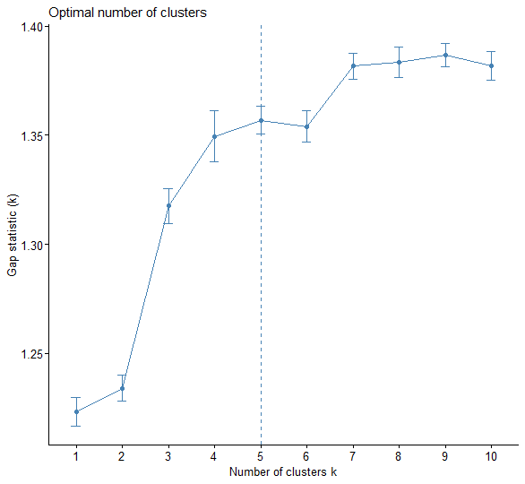

## Introducción

La **Dirección de Población** de la **Dirección General de Población, Desarrollo y Voluntariado (DGPDV)**, del **Viceministerio de Poblaciones Vulnerables (VMPV)** del **Ministerio de la Mujer y Poblaciones Vulnerables (MIMP)**, ha iniciado un proceso sistemático de análisis y construcción de indicadores estratégicos vinculados a la dinámica demográfica y a la situación de las poblaciones vulnerables en el país. Esta iniciativa se enmarca en el fortalecimiento de la plataforma web **InfoPoblación**, concebida como un espacio de difusión de información estadística accesible, confiable y pertinente para la formulación de políticas públicas y la toma de decisiones basadas en evidencia a nivel regional y subnacional.

La construcción de estos **perfiles demográficos a nivel distrital** responde a los objetivos de la *Línea de trabajo 3: Gestión del conocimiento poblacional*, que busca generar conocimiento a través de estudios especializados y difundirlo en formatos estratégicos y accesibles.

Esta acción se complementa con la *Línea de trabajo 1: Política Nacional de Población*, al brindar insumos que faciliten la implementación de los Programas Regionales de Población, promoviendo una adecuada planificación territorial basada en la estructura por edades. Asimismo, contribuye a la *Línea de trabajo 2: Seguimiento a compromisos internacionales y nacionales*, al fortalecer el monitoreo del cumplimiento del **Programa de Acción de la CIPD** y del **Consenso de Montevideo sobre Población y Desarrollo**.

En este marco, se agregan estos perfiles demográficos distritales según **dependencia demográfica** en InfoPoblación, permitiendo visualizar de manera sintética la presión demográfica sobre la población en edad laboral. Esta herramienta facilita la identificación de territorios con mayores niveles de dependencia, orientando políticas públicas más focalizadas.

## Construcción de perfile distritales según indicadores de dependencia demográfica

a razón de dependencia demográfica es un indicador comúnmente utilizado para medir la presión que ejerce la población dependiente (menores de 15 años, y las personas de 65 años y más) sobre la población en edad productiva (personas de 15 a 64 años). Sin embargo, este indicador presenta limitaciones importantes al momento de evaluar la carga real de dependencia, dado que solo considera dos grandes grupos etarios y no permite distinguir los subgrupos que los conforman, los cuales tienen características específicas.

Por esta razón, para construir perfiles demográficos distritales más precisos sobre la dependencia demográfica, es necesario ir más allá de la relación tradicional de dependencia; y considerar variables que reflejen la dinámica de distintos grupos poblacionales, tales como las personas de 0 a 14 años, de 50 a 64 años, de 65 años y más, y de 80 años y más. En este contexto, se propone la creación de perfiles demográficos basados en indicadores que toman en cuenta estos grupos etarios, y aportan información sobre el proceso de envejecimiento y la carga de dependencia: la relación de dependencia juvenil, la relación de dependencia por vejez, la relación de apoyo potencial y la relación de apoyo a los padres.

Estos indicadores no solo cuantifican la presión demográfica sobre los grupos en edad productiva, sino que también evidencian las necesidades específicas en términos de educación, salud, protección social y cuidados familiares. Por ejemplo, una alta relación de dependencia juvenil señala la necesidad de fortalecer servicios como educación y salud materno-infantil, mientras que una elevada relación de dependencia por vejez y una baja relación de apoyo potencial alertan sobre el aumento de la demanda en servicios geriátricos, pensiones, cuidados sociales y una sobrecarga alta sobre la población en edad de trabajar (15 a 64 años). Además, la relación de apoyo a los padres permite visibilizar el papel crucial de los adultos de 50 a 64 años como cuidadores principales, orientando la formulación de políticas de apoyo y bienestar social.

En conjunto, estas variables facilitan la identificación de patrones demográficos y sociales diferenciados en cada distrito, permitiendo una planificación territorial más eficiente y la focalización adecuada de recursos para atender las diversas realidades demográficas.

## Descripción de variables

-   **Relación de dependencia juvenil**: Es el cociente entre el número de personas de 0 a 14 años de edad y las personas de 15 a 64 años. Este indicador mide cuántas personas menores de 15 años hay por cada 100 personas entre 15 y 64 años.

$$
RDD_{JOVE_i} = \frac{P_{0-14_i}}{P_{15-64_i}} \times 100
$$

**Donde:**

$$(P\_{0-14_i}): \text{población de 0 a 14 años en el distrito i}$$

$$(P\_{15-64_i}):\text {población de 15 a 64 años en el distrito i}$$

-   **Relación de dependencia por vejez:** Es el cociente entre el número de personas de 65 años y más, y las personas de 15 a 64 años. Este indicador mide cuántas personas de 65 años y más hay por cada 100 personas entre 15 y 64 años.

$$
RDD_{VEJEZ_i} = \frac{P_{65+_i}}{P_{15-64_i}} \times 100
$$

$$
(P_{65+_i}): \text{ población de 65 años y más en el distrito } i
$$

$$
(P_{15-64_i}): \text{ población de 15 a 64 años en el distrito } i
$$

-   **Relación de apoyo potencial:** Es el cociente entre el número de personas de 15 a 64 años, y las personas de 65 años y más. Este indicador mide cuántas personas en edad de trabajar en el rango etario de 15 a 64 años podrán apoyar potencialmente a las personas de 65 años y más.

$$
RA_{POTENCIAL_i} = \frac{P_{15-64_i}}{P_{65+_i}}
$$

$$
(P_{15-64_i}): \text{ población de 15 a 64 años}
$$

$$
(P_{65+_i}): \text{ población de 65 años y más}
$$

-   **Relación de apoyo a los padres:** Es el cociente entre el número de personas de 80 años y más, y las personas de 50 a 64 años. Este indicador mide cuántas personas de 80 años y más hay por cada 100 personas de 50 a 64 años. Se basa en una lógica generacional, donde se interpreta que las personas mayores de 80 años tienen hijos en el rango etario de 50 a 64 años, y podrían asumir un rol activo en la prestación de cuidados (Prieto Rosas & Robello, 2023)

$$
RA_{PADRES_i} = \frac{P_{80+_i}}{P_{50-64_i}} \times 100
$$

$$
(P_{80+_i}): \text{ población de 80 años y más}
$$

$$
(P_{50-64_i}): \text{ población de 50 a 64 años}
$$

## Metodología

### Método k-means

El método de K-means, también conocido como el algoritmo de clustering de K-means, es un método de agrupación no jerárquico, el número de agrupaciones o clústeres (k) es previamente determinado, que asigna a cada observación en uno de los k clústeres (James, Witten, Hastie y Tibshirani, 2017, pp. 386). Las observaciones dentro de cada clúster son lo más similares posibles entre sí. Este método agrupará los distritos en k clústeres según las variables de dependencia (relación de dependencia juvenil y por vejez, y relación de apoyo potencial y a los padres). Matemáticamente, es un proceso iterativo que busca encontrar k clusters que minimice la varianza en cada cluster (Hartigan y Wong, 1979). Es decir, busca minimizar la suma de las distancias cuadráticas entre los puntos de cada observación y sus centroides de clúster.

Primero, se calcula la distancia euclidiana de cada punto $(x_i)$ a cada centroide $(u_k):$ $$
d(x_i, \mu_k) = \sqrt{\sum_{j=1}^{d}(x_{ij} - \mu_{kj})^2}
$$

Donde:

-   $j$: variable de dependencia (relación de dependencia juvenil, relación de dependencia por vejez, relación de apoyo potencial y relación de apoyo a los padres).
-   $x_i$: vector de variables del distrito $i$.
-   $\mu_k$: centroide (vector promedio) del clúster $k$.
-   $x_{ij}$: valor de la variable $j$ para el distrito $i$.
-   $\mu_{kj}$: valor de la variable $j$ del centroide del clúster $k$.

Se calcula esa distancia para cada clúster $k = 1, 2, \ldots, K$. Luego, se asigna el punto $x_i$ al clúster $C_k$ cuyo centroide está más cercano.

Posteriormente, se recalculan los centroides de cada clúster mediante el promedio de todas las coordenadas de los puntos asignados:

$$
\mu_k =
\frac{1}{n_k}
\sum_{i \in C_k} x_i
$$

Donde:

-   $n_k$: número de puntos asignados al clúster $k$.
-   $C_k$: conjunto de distritos asignados al clúster $k$.

Se repiten los pasos de asignación y recalculación hasta que los centroides no cambien significativamente entre iteraciones, las asignaciones de puntos de clústeres se estabilicen o se alcance un número máximo de iteraciones. Con estos nuevos centroides, se evalúa la calidad del agrupamiento con la función objetivo $J$. $$
J = \sum_{k=1}^{K} \sum_{i \in C_k} \left\| x_i - \mu_k \right\|^2
$$

### Método del codo (*elbow method*)

El método del codo es un método directo que determina el número óptimo de clústeres, $k^*$, considerando que debe alcanzarse una baja variación total o inercia dentro de los clústeres, con el objetivo de encontrar un equilibrio entre la inercia y la cantidad de clústeres (Medium, 2019). Es decir, busca el punto donde añadir más clústeres no mejora significativamente la reducción de la suma de las distancias cuadradas intra-clúster. Para ello, primero se calcula la distorsión.

$$
\text{Distorsión} = \frac{\sum_{i=1}^{n_k} \left\| x_i - \mu_k \right\|^2}{n_k}
$$

La distorsión mide la compacidad de los clústeres: cuanto más baja sea la distorsión, los puntos estarán más próximos a sus centroides, lo que indica una mejor agrupación.

### Método Gap Statistics

El método *Gap Statistic* o método de brecha es una prueba estadística que compara la variabilidad interna de los clústeres observados con la variabilidad esperada en una distribución nula (sin estructura de agrupamiento) (Tibshirani, Walther y Hastie, 2001). El número óptimo de clústeres será aquel que maximice esta brecha, donde la estructura de los datos es más pronunciada y menos atribuible al azar. Esto indica que el agrupamiento observado es más significativo y no producto de fluctuaciones aleatorias.

La estadística Gap se define como:

$$
Gap(k)=\frac{1}{B}\sum_{b=1}^{B} W_k^b - W_k
$$

Donde:

-   $W_k$: suma de los errores cuadrados dentro del clúster $k$.
-   $W_k^b$: suma de los errores cuadrados dentro del clúster $k$ para los datos de referencia.
-   $B$: número de conjuntos de datos de referencia.

Y el número óptimo de clústeres se elige como el valor más pequeño de $k$ que cumple la siguiente condición:

$$
Gap(k)\geq Gap(k+1)-SE(k+1)
$$

Donde:

-   $SE(k+1)$: error estándar del estadístico Gap para $k+1$ clústeres.

## Base de datos

Se utilizó información poblacional proveniente del Repositorio Único Nacional de Información en Salud del Ministerio de Salud del Perú (MINSA) correspondiente al año 2025. La base de datos empleada contiene información de los 1891 distritos del país e incluye las siguientes variables:

### Tabla 1.

**Descripción de variables**

| Variable       | Descripción                                           |
|----------------|-------------------------------------------------------|
| `UBIGEO`       | Código de Ubicación Geográfica de 6 dígitos           |
| `PROVINCIA`    | Nombre de la provincia a la que pertenece el distrito |
| `DISTRITO`     | Nombre del distrito                                   |
| `RDD_JOVE`     | Relación de dependencia juvenil                       |
| `RDD_VEJEZ`    | Relación de dependencia por vejez                     |
| `RA_POTENCIAL` | Relación de apoyo potencial                           |
| `RA_PADRES`    | Relación de apoyo a los padres                        |

Las variables numéricas fueron estandarizadas ($\mu = 0$ y $\sigma = 1$), debido a que cuando las variables presentan rangos o unidades de medida diferentes, algunas pueden dominar el cálculo de la distancia euclidiana utilizada por el algoritmo de agrupamiento *K-means*. La estandarización permite que todas las variables se encuentren en una escala comparable, asegurando que cada una contribuya de manera equilibrada al análisis y evitando que alguna tenga una influencia desproporcionada en la formación de los clústeres.

Puede acceder a la base de datos [aquí](www.infopoblación.gob.pe)

## Proceso del análisis del método de *K-means clustering*

Para determinar el número óptimo de clústeres ($k$), primero se realizó un análisis de componentes principales (*Principal Component Analysis* - PCA). En el Gráfico 1 se observa que la dimensión 1 explica el 74.4% de la variabilidad total, mientras que la dimensión 2 explica el 16.9%. En conjunto, ambas dimensiones explican el 91.3% de la variabilidad total de los datos.

A partir de este análisis se identificaron cinco clústeres. Los clústeres 1 y 5 presentan una mayor dispersión, lo que indica una mayor heterogeneidad interna entre los distritos que los conforman. Por el contrario, los clústeres 2, 3 y 4 muestran una estructura más compacta, evidenciando una mayor similitud entre los distritos pertenecientes a cada grupo.

{fig-align="center" width="550"}

Luego, se aplicó el método del codo. En el Gráfico 2., se muestra una caída significativa en la variabilidad entre 1 y 3 clústeres, pero no se identifica un “codo” claramente definido, dado que sugiere entre 3 y 5 clústeres.

{fig-align="center"}

Por ello, se procede a realizar el método de *Gap Statistics*. En el Gráfico 3 se observa que la brecha alcanza un máximo cercano en $k = 5$ y luego se estabiliza, indicando que este es el número óptimo de clústeres. Esta técnica complementa y confirma la selección de $k^* = 5$, apoyando una agrupación que balancea adecuadamente la homogeneidad interna y la heterogeneidad entre grupos.

